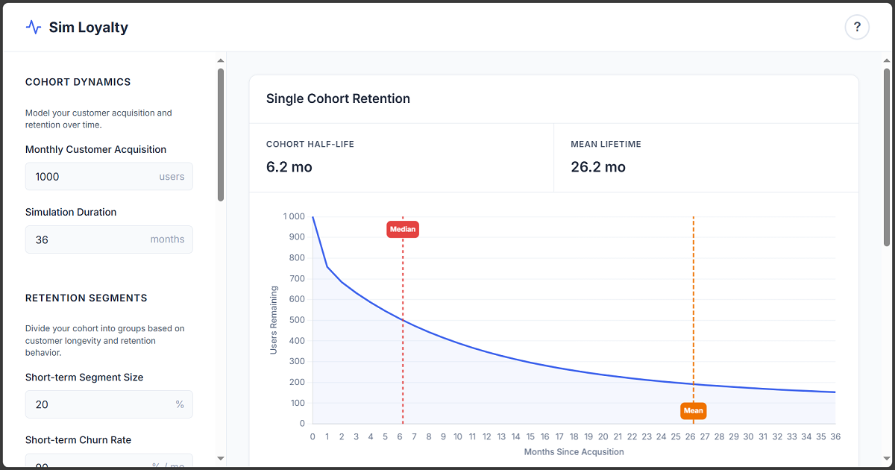

# Sim Loyalty

A powerful, interactive customer retention and growth simulator that helps you model and predict customer base dynamics over time.



## Overview

Sim Loyalty uses a **three-segment retention model** to simulate how customer cohorts behave over time. By dividing customers into short-term, medium-term, and long-term retention segments, you can:

- 📊 Model realistic customer retention curves
- 📈 Predict long-term customer base growth
- 🎯 Calculate key metrics like median lifetime, mean lifetime, and growth asymptotes
- 🔧 Fit theoretical models to your actual retention data

## Features

### Three-Segment Retention Model
Divide your customer base into segments based on longevity:
- **Short-term**: High churn, typically exploratory users
- **Medium-term**: Moderate retention, regular users
- **Long-term**: Low churn, highly engaged customers

### Interactive Visualizations
- **Single Cohort Retention**: See how one cohort decays over time with segment breakdown
- **Multi-Cohort Growth**: Model total customer base with monthly acquisition
- **Actual Data Overlay**: When curve fitting, your real data appears as light blue dots
- Real-time chart updates as you adjust parameters

### Curve Fitting with Visual Validation
- Paste your actual retention data (percentages by month)
- Automatically fit the three-segment model to your data
- **See your actual data as light blue dots** overlaid on the model prediction
- Visually validate fit quality at a glance
- Perfect for working with real cohort data from your analytics platform

### Built-in Presets
Quick-start with realistic example scenarios:
- **SaaS Startup**: High early churn, rapid growth potential
- **E-commerce**: Moderate retention patterns
- **Mobile App**: Very high initial churn, small loyal base
- **Enterprise B2B**: Low churn, long-term relationships

### Save & Load Parameter Sets
- Save unlimited named parameter sets (e.g., "Q4 Projections", "Best Case")
- Saved sets include fitted data from curve fitting
- Quick switching between scenarios
- Persists in browser storage

### Export & Share
- **Download charts as PNG**: High-quality images for presentations
- **Export to CSV**: Full simulation data for Excel/Sheets analysis
- **Shareable links**: Copy URL with parameters to share with colleagues
- All exports reflect current simulation state

### Key Metrics
- **Cohort Half-Life (Median)**: When 50% of customers have churned
- **Mean Customer Lifetime**: Average customer lifespan
- **Growth Asymptote**: Steady-state customer base (if churn > 0)

## Getting Started

### Live Demo
Visit the hosted version at: **https://roenbaeck.github.io/sim-loyalty/**

### Local Usage
Simply open `index.html` in your web browser. No installation or build process required!

### Quick Start with Presets

1. Select a preset from **Presets & Saved Sets** dropdown
2. Choose: SaaS Startup, E-commerce, Mobile App, or Enterprise B2B
3. Charts update automatically - explore and modify as needed

### Manual Setup

1. **Set Monthly Acquisition**: How many new customers you acquire each month
2. **Define Retention Segments**: 
   - Set the percentage split (must sum to 100%)
   - Set monthly churn rate for each segment
3. **Run Simulation**: Click "Run Simulation" to see results

### Advanced: Fit to Real Data

1. Click "🎯 Fit Model to Data" 
2. Paste your retention percentages (one per month, starting at 100%)
3. Click "Fit Parameters" to automatically calculate optimal segment parameters
4. Your actual data appears as **light blue dots** on the retention chart
5. Compare the fitted model (blue line) with your actual data visually

### Save Your Work

1. Configure your parameters (manually or via curve fitting)
2. Enter a name in "Save Current Parameters As"
3. Click 💾 Save
4. Load anytime from the dropdown - your fitted data is preserved!

## Use Cases

- **SaaS/Subscription Planning**: Model MRR growth and churn scenarios
- **E-commerce Retention**: Predict repeat purchase patterns
- **Mobile Apps**: Understand user engagement and lifecycle
- **Marketplaces**: Balance supply/demand growth with retention
- **Product Strategy**: Evaluate impact of retention improvements

## Technical Details

### Model Assumptions
- Monthly time periods (suitable for most businesses)
- Exponential decay within each segment
- Constant monthly churn rates per segment
- Fixed monthly customer acquisition

### Calculations
- Retention uses compound decay: `remaining(t) = initial × (1 - churn_rate)^t`
- Growth sums all active cohorts at each time point
- Asymptote (if exists): `sum(segment_size / segment_churn_rate)` for each segment

### Note on Acquisition Growth
This model assumes **fixed monthly acquisition** to isolate retention dynamics and calculate steady-state (asymptote). This lets you answer questions like:
- "At 1,000 customers/month, what's our ceiling?"
- "How much does improving retention lift our steady-state?"

**For growing acquisition** (e.g., 1,000 → 1,100 → 1,200/month), run multiple scenarios at different acquisition levels and interpolate externally, or build your own growth projections on top of the retention insights. Mixing acquisition growth with retention modeling makes it harder to isolate what drives results.

## Model Limitations & Validation

### When It Works Best
The three-segment exponential model works best for:
- ✅ Steady churn patterns (SaaS, subscriptions, consumer apps)
- ✅ Multiple distinct customer behavior groups
- ✅ Exponential decay within segments (including 0% churn = plateau)
- ✅ Gradual reactivation (captured as lower effective churn rates)

### Known Limitations
May struggle with:
- ❌ **S-curves**: Slow start, then rapid churn
- ❌ **U-curves/Smiley patterns**: Retention improving over time
- ❌ **Sudden step changes**: Discontinuous retention patterns
- ❌ **Massive reactivation campaigns**: Churned users returning en masse
- ❌ **Network effects**: Retention improving as product matures
- ❌ **Seasonal patterns**: Time-varying churn rates

### Validation
After curve fitting:
- **Avg Error (MAPE)**: <5% = excellent, 5-10% = good, >10% = review fit visually
- **Visual inspection**: Compare light blue dots (actual) vs. fitted line - look for systematic patterns
- **R² metric**: Shows variance explained but can be misleading - use Avg Error instead

### 🧪 Stress Test Examples

Try fitting these patterns to see model performance:

**S-Curve (Poor Fit Expected):**
```
100, 95, 90, 85, 75, 60, 40, 25, 18, 15, 13, 12
```
*Slow initial churn, then rapid - model struggles with this pattern*

**Smiley/U-Curve (Poor Fit Expected):**
```
100, 70, 50, 40, 35, 38, 42, 47, 52, 56, 60, 63
```
*Retention improves over time (reactivation/network effects) - exponential decay can't capture this*

**Typical SaaS (Excellent Fit):**
```
100, 82, 73, 65, 58, 52, 47, 43, 39, 36, 33, 31
```
*Classic exponential decay - model excels here*

**Plateau/Sticky Users (Excellent Fit):**
```
100, 80, 70, 65, 63, 62, 61, 60, 60, 60, 60, 60
```
*Model handles this well with long-term segment at 0% churn*

### Stress Test Examples
Try curve fitting these patterns to explore limitations:
- **Plateau**: `100, 80, 70, 65, 63, 62, 61, 60, 60, 60` (poor fit expected)
- **S-Curve**: `100, 95, 90, 85, 75, 60, 40, 25, 18, 15` (challenging)
- **Typical SaaS**: `100, 82, 73, 65, 58, 52, 47, 43, 39` (good fit expected)

## Tips

- **Start with presets** to quickly understand the model and see realistic parameters
- **Save multiple scenarios** to compare strategies ("Optimistic", "Conservative", "Current")
- **Use real data**: The curve fitting works best with 6-12+ months of cohort data
- **Visual validation**: Light blue dots show how well your model fits actual data
- **Export for presentations**: Download charts as PNG for stakeholder meetings
- **Share with colleagues**: Use shareable links to discuss assumptions as a team
- **Experiment freely**: Test "what-if" scenarios - your saved sets are always available

## License

See [LICENSE](LICENSE) file for details.

## Deployment

This project uses GitHub Pages for hosting:

1. Go to **Settings** → **Pages** in your GitHub repository
2. Under "Source", select **main** branch
3. Save and wait a few minutes for deployment
4. Access at `https://roenbaeck.github.io/sim-loyalty/`

Changes pushed to the main branch are automatically deployed.

## Contributing

This is a single-file HTML application. Feel free to fork, modify, and improve!

