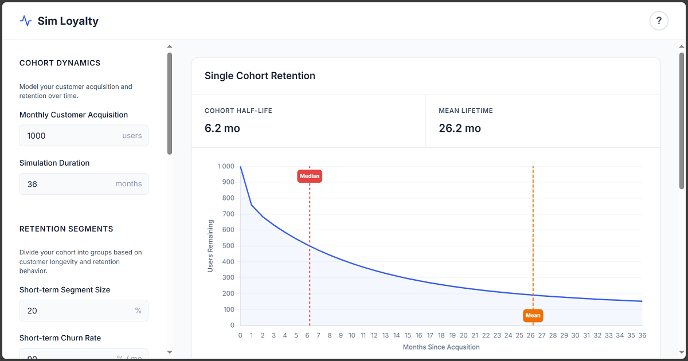

# Sim Loyalty

A powerful, interactive customer retention and growth simulator that helps you model and predict customer base dynamics over time.



## Overview

Sim Loyalty uses a **three-segment retention model** to simulate how customer cohorts behave over time. By dividing customers into short-term, medium-term, and long-term retention segments, you can:

- 📊 Model realistic customer retention curves
- 📈 Predict long-term customer base growth
- 🎯 Calculate key metrics like median lifetime, mean lifetime, and growth asymptotes
- 🔧 Fit theoretical models to your actual retention data

## Features

### Three-Segment Retention Model
Divide your customer base into segments based on longevity:
- **Short-term**: High churn, typically exploratory users
- **Medium-term**: Moderate retention, regular users
- **Long-term**: Low churn, highly engaged customers

### Interactive Visualizations
- **Single Cohort Retention**: See how one cohort decays over time with segment breakdown
- **Multi-Cohort Growth**: Model total customer base with monthly acquisition
- **Stacked Area Charts**: Visual breakdown showing each segment's contribution to retention and growth
- **Actual Data Overlay**: When curve fitting, your real data appears as blue dots
- **Live auto-updates**: Charts refresh automatically as you adjust parameters (300ms debounce)
- **Interactive range sliders**: Fluid parameter adjustments with visual feedback
- **Segment sum indicator**: Visual progress bar plus proportional normalization to exactly 100%
- **Undo and reset**: Restore the previous valid scenario or return to defaults

### Curve Fitting with Visual Validation
- Paste your actual retention data (percentages by month)
- Fits retention from a single cohort; acquisition is a separate simulation input and does not affect the fit
- **Advanced multi-method optimization**: Runs and compares 4 different algorithms (Grid Search, Differential Evolution, Random Restart, and Simulated Annealing) to find the best fit
- Automatically selects the optimal result from all methods
- **See your actual data as blue dots** overlaid on the model prediction
- Visually validate fit quality at a glance
- Robust fitting across diverse retention patterns, from simple decay to complex multi-segment behaviors
- Perfect for working with real cohort data from your analytics platform

### Built-in Presets
Quick-start with realistic example scenarios:
- **SaaS Startup**: High early churn, rapid growth potential
- **E-commerce**: Moderate retention patterns
- **Mobile App**: Very high initial churn, small loyal base
- **Enterprise B2B**: Low churn, long-term relationships

### Save & Load Parameter Sets
- Save unlimited named parameter sets (e.g., "Q4 Projections", "Best Case")
- Saved sets include fitted data from curve fitting
- Quick switching between scenarios
- Persists in browser storage

### Export & Share
- **Download charts as PNG**: High-quality images for presentations
- **Export to CSV**: Full simulation data for Excel/Sheets analysis
- **Model links**: Copy model parameters to share with colleagues; fitted observations are excluded
- **Auto-save via URL**: Valid model parameters are automatically saved in the URL
- All exports reflect current simulation state

### Key Metrics
- **Cohort Half-Life (Median)**: When 50% of customers have churned
- **Average Customer Lifetime**: Average customer lifespan
- **Growth Asymptote**: Steady-state customer base when every non-empty segment has positive churn

## Getting Started

### Live Demo
Visit the hosted version at: **https://roenbaeck.github.io/sim-loyalty/**

### Local Usage
Simply open `index.html` in your web browser. No installation or build process required!

### Quick Start with Presets

1. Select a preset from **Presets & Saved Sets** dropdown
2. Choose: SaaS Startup, E-commerce, Mobile App, or Enterprise B2B
3. Charts update automatically - explore and modify as needed

### Manual Setup

1. **Set Steady Monthly Acquisition**: How many new customers you acquire each month (1 to 1,000,000), held constant to isolate retention
2. **Define Retention Segments**: 
   - Set the percentage split (must total exactly 100%)
   - Watch the segment sum indicator (green = valid, orange/red = invalid)
   - Use **Normalize segments to 100%** to rebalance all three sizes proportionally
   - Use range sliders for quick adjustments
   - Set monthly churn rate for each segment
3. **Set Simulation Duration**: Choose 1 to 600 months
4. **Live Updates**: Charts update automatically as you adjust valid parameters - no button needed!
5. **Undo or Reset**: Restore the previous valid scenario or return to defaults
6. **Auto-Save**: Valid model parameters are saved in the URL

### Advanced: Fit to Real Data

1. Click "🎯 Fit Model to Data" 
2. Paste your retention percentages (one per month, starting at 100%)
3. Click "Fit Parameters" to automatically calculate optimal segment parameters
4. Your actual data appears as **blue dots** on the retention chart
5. Compare the fitted model (blue line) with your actual data visually

### Save Your Work

1. Configure your parameters (manually or via curve fitting)
2. Enter a name in "Save Current Parameters As"
3. Click 💾 Save
4. Load anytime from the dropdown - your fitted data is preserved!

## Use Cases

- **SaaS/Subscription Planning**: Model MRR growth and churn scenarios
- **E-commerce Retention**: Predict repeat purchase patterns
- **Mobile Apps**: Understand user engagement and lifecycle
- **Marketplaces**: Balance supply/demand growth with retention
- **Product Strategy**: Evaluate impact of retention improvements

## Technical Details

### Model Assumptions
- Monthly time periods (suitable for most businesses)
- Exponential decay within each segment
- Constant monthly churn rates per segment
- Steady gross monthly customer acquisition

### Calculations
- Retention uses compound decay: `remaining(t) = initial × (1 - churn_rate)^t`
- Growth sums all active cohorts at each time point
- Asymptote (if exists): `sum(segment_size / segment_churn_rate)` for each segment

### Why Acquisition Stays Constant
This model assumes **steady gross monthly acquisition** to isolate retention dynamics and calculate a meaningful steady-state customer base. Gross acquisition is the number of customers entering the business; it is not net customer growth.

A stable market does not contain the same people forever. People can enter and leave at balanced rates, keeping the total addressable market stable while its membership changes. A mature business can therefore maintain steady acquisition through a combination of new market entrants and replacements for customers who leave.

At equilibrium:

`gross customer acquisition = customer outflow`

The active customer base then has zero net growth even though customers continue to enter and leave. Constant acquisition describes a stable **flow**, not a frozen market or an unchanging group of customers.

This assumption is realistic for:
- Mature businesses in stable markets
- Companies with consistent marketing spend
- Market-share limited acquisition (e.g., B2B, niches)

Fixed acquisition lets you answer key strategic questions:
- "At 1,000 customers/month, what's our ceiling?"
- "How much does improving retention lift our steady-state?"

The simulator does **not** model addressable market size or a market-share cap. Its growth asymptote is the customer base supported by the selected acquisition and retention assumptions. If the real attainable market is smaller, successful acquisition would eventually have to decline toward the replacement rate as that cap is approached.

**For high-growth scenarios** (e.g., 1,000 → 1,500 → 2,000/month), run separate scenarios at several fixed acquisition levels. Adding speculative compounding acquisition can hide the effect of retention and removes the fixed growth ceiling.

## Scientific Basis

Sim Loyalty combines established ideas from queueing theory, survival analysis, and customer-base analysis. The individual calculations are not new; the tool makes their interaction visible and easy to explore.

### Growth Ceiling and Little's Law

Little's Law states that the average number of entities in a stable system equals their arrival rate multiplied by their average time in the system:

`average customer base = acquisition rate × average customer lifetime`

For segment weight `wᵢ` and positive monthly churn rate `cᵢ`, the model's mean customer lifetime is `Σ(wᵢ / cᵢ)`. Its growth ceiling is therefore:

`growth ceiling = monthly acquisition × Σ(wᵢ / cᵢ)`

This is the same calculation performed by the simulator. Little's Law requires stable flows and finite means, but it does not require the identities in the system to remain fixed. Customers can continually enter and leave while the average active customer base remains stable. A populated zero-churn segment has infinite expected lifetime, so the model correctly has no finite ceiling in that case.

### Retention as Survival

A cohort-retention curve is a survival function: it gives the proportion of a cohort remaining active through each period. Median lifetime, mean lifetime, and churn hazards are standard survival-analysis concepts.

The model represents customer heterogeneity as a weighted mixture of three geometric survival curves. This is a practical finite-mixture approximation of the broader idea that customers can have persistently different churn propensities.

Using exactly three segments is a modeling convention, not a scientific law. A good fit supports the estimated retention curve, but does not prove that three literal customer types exist. More complete retention models may also include duration dependence, promotions, cohort effects, seasonality, or other calendar-time effects.

### References

- Little, J. D. C. (1961). [A Proof for the Queuing Formula: L = λW](https://doi.org/10.1287/opre.9.3.383). *Operations Research, 9*(3), 383-387.
- Kaplan, E. L., & Meier, P. (1958). [Nonparametric Estimation from Incomplete Observations](https://doi.org/10.1080/01621459.1958.10501452). *Journal of the American Statistical Association, 53*(282), 457-481.
- Fader, P. S., & Hardie, B. G. S. (2007). [How to Project Customer Retention](https://doi.org/10.1002/dir.20074). *Journal of Interactive Marketing, 21*(1), 76-90.
- Schweidel, D. A., Fader, P. S., & Bradlow, E. T. (2008). [Understanding Service Retention within and across Cohorts Using Limited Information](https://doi.org/10.1509/jmkg.72.1.082). *Journal of Marketing, 72*(1), 82-94.
- McLachlan, G., & Peel, D. (2000). [Finite Mixture Models](https://doi.org/10.1002/0471721182). Wiley.

## Model Limitations & Validation

### When It Works Best
The three-segment exponential model works best for:
- ✅ Steady churn patterns (SaaS, subscriptions, consumer apps)
- ✅ Multiple distinct customer behavior groups
- ✅ Exponential decay within segments (including 0% churn = plateau)
- ✅ Gradual reactivation (captured as lower effective churn rates)

### Known Limitations
May struggle with:
- ❌ **S-curves**: Slow start, then rapid churn
- ❌ **U-curves/Smiley patterns**: Retention improving over time
- ❌ **Sudden step changes**: Discontinuous retention patterns
- ❌ **Massive reactivation campaigns**: Churned users returning en masse
- ❌ **Network effects**: Retention improving as product matures
- ❌ **Seasonal patterns**: Time-varying churn rates

### Validation
After curve fitting:
- **Avg Error (MAPE)**: <5% = excellent, 5-10% = good, >10% = review fit visually
- **Visual inspection**: Compare blue dots (actual) vs. fitted line - look for systematic patterns
- **R² metric**: Shows variance explained but can be misleading - use Avg Error instead

### 🧪 Stress Test Examples

Try fitting these patterns to see model performance:

**S-Curve (Poor Fit Expected):**
```
100, 95, 90, 85, 75, 60, 40, 25, 18, 15, 13, 12
```
*Slow initial churn, then rapid - model struggles with this pattern*

**Smiley/U-Curve (Poor Fit Expected):**
```
100, 70, 50, 40, 35, 38, 42, 47, 52, 56, 60, 63
```
*Retention improves over time (reactivation/network effects) - exponential decay can't capture this*

**Typical SaaS (Excellent Fit):**
```
100, 82, 73, 65, 58, 52, 47, 43, 39, 36, 33, 31
```
*Classic exponential decay - model excels here*

**Plateau/Sticky Users (Excellent Fit):**
```
100, 80, 70, 65, 63, 62, 61, 60, 60, 60, 60, 60
```
*Model handles this well with long-term segment at 0% churn*

## Tips

- **Start with presets** to quickly understand the model and see realistic parameters
- **Save multiple scenarios** to compare strategies ("Optimistic", "Conservative", "Current")
- **Use real data**: The curve fitting works best with 6-12+ months of cohort data
- **Visual validation**: Blue dots show how well your model fits actual data
- **Export for presentations**: Download charts as PNG for stakeholder meetings
- **Share with colleagues**: Use model links to discuss assumptions as a team; save locally when fitted observations must be retained
- **Experiment freely**: Test "what-if" scenarios - your saved sets are always available

## License

See [LICENSE](LICENSE) file for details.

## Deployment

This project uses GitHub Pages for hosting:

1. Go to **Settings** → **Pages** in your GitHub repository
2. Under "Source", select **main** branch
3. Save and wait a few minutes for deployment
4. Access at `https://roenbaeck.github.io/sim-loyalty/`

Changes pushed to the main branch are automatically deployed.

## Contributing

This is a single-file HTML application. Feel free to fork, modify, and improve!

