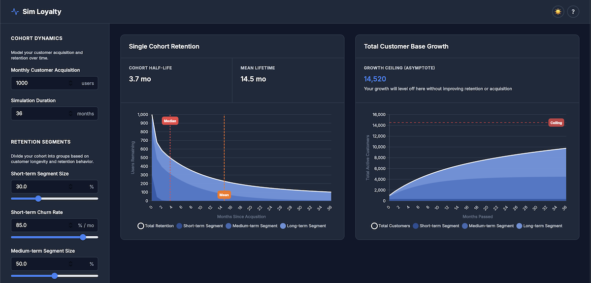

# Sim Loyalty

A powerful, interactive customer retention and growth simulator that helps you model and predict customer base dynamics over time.



## Overview

Sim Loyalty uses a **three-segment retention model** to simulate how customer cohorts behave over time. By dividing customers into short-term, medium-term, and long-term retention segments, you can:

- 📊 Model realistic customer retention curves
- 📈 Predict long-term customer base growth
- 🎯 Calculate key metrics like median lifetime, mean lifetime, and growth asymptotes
- 🔧 Fit theoretical models to your actual retention data

## Features

### Three-Segment Retention Model
Divide your customer base into segments based on longevity:
- **Short-term**: High churn, typically exploratory users
- **Medium-term**: Moderate retention, regular users
- **Long-term**: Low churn, highly engaged customers

### Interactive Visualizations
- **Single Cohort Retention**: See how one cohort decays over time with segment breakdown
- **Multi-Cohort Growth**: Model total customer base with monthly acquisition
- **Stacked Area Charts**: Visual breakdown showing each segment's contribution to retention and growth
- **Actual Data Overlay**: When curve fitting, your real data appears as blue dots
- **Live auto-updates**: Charts refresh automatically as you adjust parameters (300ms debounce)
- **Interactive range sliders**: Fluid parameter adjustments with visual feedback
- **Segment sum indicator**: Visual progress bar ensuring segments total 100%

### Curve Fitting with Visual Validation
- Paste your actual retention data (percentages by month)
- **Advanced multi-method optimization**: Uses 4 different algorithms simultaneously (Grid Search, Differential Evolution, Random Restart, and Simulated Annealing) to find the best fit
- Automatically selects the optimal result from all methods
- **See your actual data as blue dots** overlaid on the model prediction
- Visually validate fit quality at a glance
- Robust fitting across diverse retention patterns, from simple decay to complex multi-segment behaviors
- Perfect for working with real cohort data from your analytics platform

### Built-in Presets
Quick-start with realistic example scenarios:
- **SaaS Startup**: High early churn, rapid growth potential
- **E-commerce**: Moderate retention patterns
- **Mobile App**: Very high initial churn, small loyal base
- **Enterprise B2B**: Low churn, long-term relationships

### Save & Load Parameter Sets
- Save unlimited named parameter sets (e.g., "Q4 Projections", "Best Case")
- Saved sets include fitted data from curve fitting
- Quick switching between scenarios
- Persists in browser storage

### Export & Share
- **Download charts as PNG**: High-quality images for presentations
- **Export to CSV**: Full simulation data for Excel/Sheets analysis
- **Shareable links**: Copy URL with parameters to share with colleagues
- **Auto-save via URL**: Parameters automatically saved in URL - refresh-proof!
- All exports reflect current simulation state

### Key Metrics
- **Cohort Half-Life (Median)**: When 50% of customers have churned
- **Average Customer Lifetime**: Average customer lifespan
- **Growth Asymptote**: Steady-state customer base (if churn > 0)

## Getting Started

### Live Demo
Visit the hosted version at: **https://roenbaeck.github.io/sim-loyalty/**

### Local Usage
Simply open `index.html` in your web browser. No installation or build process required!

### Quick Start with Presets

1. Select a preset from **Presets & Saved Sets** dropdown
2. Choose: SaaS Startup, E-commerce, Mobile App, or Enterprise B2B
3. Charts update automatically - explore and modify as needed

### Manual Setup

1. **Set Monthly Acquisition**: How many new customers you acquire each month
2. **Define Retention Segments**: 
   - Set the percentage split (must sum to 100%)
   - Watch the segment sum indicator (green = valid, orange/red = invalid)
   - Use range sliders for quick adjustments
   - Set monthly churn rate for each segment
3. **Live Updates**: Charts update automatically as you adjust parameters - no button needed!
4. **Auto-Save**: Your parameters are saved in the URL - refresh won't lose your work!

### Advanced: Fit to Real Data

1. Click "🎯 Fit Model to Data" 
2. Paste your retention percentages (one per month, starting at 100%)
3. Click "Fit Parameters" to automatically calculate optimal segment parameters
4. Your actual data appears as **blue dots** on the retention chart
5. Compare the fitted model (blue line) with your actual data visually

### Save Your Work

1. Configure your parameters (manually or via curve fitting)
2. Enter a name in "Save Current Parameters As"
3. Click 💾 Save
4. Load anytime from the dropdown - your fitted data is preserved!

## Use Cases

- **SaaS/Subscription Planning**: Model MRR growth and churn scenarios
- **E-commerce Retention**: Predict repeat purchase patterns
- **Mobile Apps**: Understand user engagement and lifecycle
- **Marketplaces**: Balance supply/demand growth with retention
- **Product Strategy**: Evaluate impact of retention improvements

## Technical Details

### Model Assumptions
- Monthly time periods (suitable for most businesses)
- Exponential decay within each segment
- Constant monthly churn rates per segment
- Fixed monthly customer acquisition

### Calculations
- Retention uses compound decay: `remaining(t) = initial × (1 - churn_rate)^t`
- Growth sums all active cohorts at each time point
- Asymptote (if exists): `sum(segment_size / segment_churn_rate)` for each segment

### Note on Acquisition Growth
This model assumes **fixed monthly acquisition** to isolate retention dynamics and calculate steady-state (asymptote). This assumption is realistic for:
- Mature businesses in stable markets
- Companies with consistent marketing spend
- Market-share limited acquisition (e.g., B2B, niches)

Fixed acquisition lets you answer key strategic questions:
- "At 1,000 customers/month, what's our ceiling?"
- "How much does improving retention lift our steady-state?"

**For high-growth scenarios** (e.g., 1,000 → 1,500 → 2,000/month), run multiple scenarios at different acquisition levels and interpolate externally. Mixing acquisition growth with retention modeling makes it harder to isolate what drives results.

## Model Limitations & Validation

### When It Works Best
The three-segment exponential model works best for:
- ✅ Steady churn patterns (SaaS, subscriptions, consumer apps)
- ✅ Multiple distinct customer behavior groups
- ✅ Exponential decay within segments (including 0% churn = plateau)
- ✅ Gradual reactivation (captured as lower effective churn rates)

### Known Limitations
May struggle with:
- ❌ **S-curves**: Slow start, then rapid churn
- ❌ **U-curves/Smiley patterns**: Retention improving over time
- ❌ **Sudden step changes**: Discontinuous retention patterns
- ❌ **Massive reactivation campaigns**: Churned users returning en masse
- ❌ **Network effects**: Retention improving as product matures
- ❌ **Seasonal patterns**: Time-varying churn rates

### Validation
After curve fitting:
- **Avg Error (MAPE)**: <5% = excellent, 5-10% = good, >10% = review fit visually
- **Visual inspection**: Compare blue dots (actual) vs. fitted line - look for systematic patterns
- **R² metric**: Shows variance explained but can be misleading - use Avg Error instead

### 🧪 Stress Test Examples

Try fitting these patterns to see model performance:

**S-Curve (Poor Fit Expected):**
```
100, 95, 90, 85, 75, 60, 40, 25, 18, 15, 13, 12
```
*Slow initial churn, then rapid - model struggles with this pattern*

**Smiley/U-Curve (Poor Fit Expected):**
```
100, 70, 50, 40, 35, 38, 42, 47, 52, 56, 60, 63
```
*Retention improves over time (reactivation/network effects) - exponential decay can't capture this*

**Typical SaaS (Excellent Fit):**
```
100, 82, 73, 65, 58, 52, 47, 43, 39, 36, 33, 31
```
*Classic exponential decay - model excels here*

**Plateau/Sticky Users (Excellent Fit):**
```
100, 80, 70, 65, 63, 62, 61, 60, 60, 60, 60, 60
```
*Model handles this well with long-term segment at 0% churn*

### Stress Test Examples
Try curve fitting these patterns to explore limitations:
- **Plateau**: `100, 80, 70, 65, 63, 62, 61, 60, 60, 60` (poor fit expected)
- **S-Curve**: `100, 95, 90, 85, 75, 60, 40, 25, 18, 15` (challenging)
- **Typical SaaS**: `100, 82, 73, 65, 58, 52, 47, 43, 39` (good fit expected)

## Tips

- **Start with presets** to quickly understand the model and see realistic parameters
- **Save multiple scenarios** to compare strategies ("Optimistic", "Conservative", "Current")
- **Use real data**: The curve fitting works best with 6-12+ months of cohort data
- **Visual validation**: Blue dots show how well your model fits actual data
- **Export for presentations**: Download charts as PNG for stakeholder meetings
- **Share with colleagues**: Use shareable links to discuss assumptions as a team
- **Experiment freely**: Test "what-if" scenarios - your saved sets are always available

## License

See [LICENSE](LICENSE) file for details.

## Deployment

This project uses GitHub Pages for hosting:

1. Go to **Settings** → **Pages** in your GitHub repository
2. Under "Source", select **main** branch
3. Save and wait a few minutes for deployment
4. Access at `https://roenbaeck.github.io/sim-loyalty/`

Changes pushed to the main branch are automatically deployed.

## Contributing

This is a single-file HTML application. Feel free to fork, modify, and improve!

